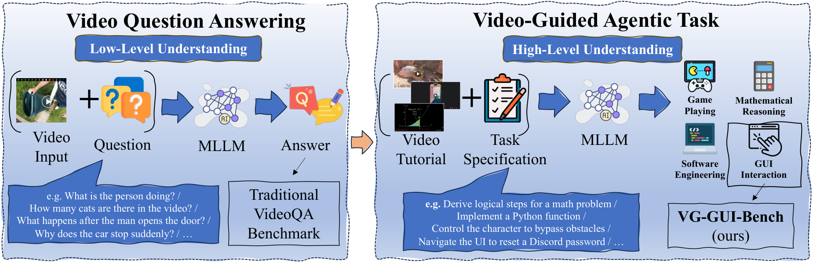

# Bridging VideoQA and Video-Guided Agentic Tasks via Generalized Keyframe Extraction

<p align="center">
  <a href="https://arxiv.org/abs/2606.29445"></a>
  <a href="https://huggingface.co/papers/2606.29445"></a>
  <a href="https://vg-gui-tasker.github.io/"></a>
  <a href="https://github.com/VG-GUI-TASKER/VG-GUI-TASKER"></a>
  <a href="https://huggingface.co/datasets/runamu/MONDAY"></a>
  <a href="https://vg-gui-tasker.github.io/#leaderboard"></a>
  <a href="https://lbesson.mit-license.org/"></a>
</p>

<p align="center">
  <a href="https://fansunqi.github.io/"><b>Sunqi Fan</b></a>, <b>Qingle Liu</b>, <b>Runqi Yin</b>, <a href="https://menghaoguo.github.io/"><b>Meng-Hao Guo</b></a>, <a href="https://www.cs.tsinghua.edu.cn/csen//info/1308/4660.htm"><b>Shuojin Yang</b></a><sup>&#9993;</sup>
  <br>
  Tsinghua University, Beijing, China &nbsp;&middot;&nbsp; <sup>&#9993;</sup> Corresponding author
  <br>
  <i>Accepted by ECCV 2026</i>
</p>

---

This is the official repository for our ECCV 2026 paper **"[Bridging VideoQA and Video-Guided Agentic Tasks via Generalized Keyframe Extraction](https://arxiv.org/abs/2606.29445)"**.

We advance video understanding from the **low-level VideoQA** paradigm toward the **high-level Video-Guided Agentic Task** paradigm. The latter requires models to learn procedural knowledge from a tutorial video and transfer it to long-horizon decision making — a form of *video in-context learning*.

<p align="center">
  
</p>

## Abstract

Recent Multimodal Large Language Models (MLLMs) achieve remarkable performance on Video Question Answering (VideoQA) benchmarks, but existing benchmarks primarily test shallow visual perception and rarely examine whether MLLMs can learn deeper procedural skills from video tutorials and generalize them to long-horizon agentic tasks. To address this gap, we introduce **VG-GUI-Bench** (Video-Guided GUI Benchmark), a new benchmark that evaluates whether MLLM-based GUI agents can follow video tutorials to complete corresponding interactive GUI tasks.

We further observe that performance on both VideoQA and video-guided agentic tasks critically depends on effective keyframe extraction. Based on this, we propose **TASKER** (**Ta**sk-driven **a**nd **S**cene-aware **Ke**yframe sea**r**cher), a keyframe extraction algorithm that jointly considers task relevance and scene dynamics. TASKER yields significant gains on both VideoQA and video-guided agentic benchmarks, outperforming the best baseline by **2.0%** on the EgoSchema fullset and **1.8%** on NExT-QA, highlighting the potential of generalized keyframe extraction for video understanding.

## Contributions

- **A Two-Level Taxonomy.** We identify a key limitation of existing video benchmarks and propose a taxonomy connecting low-level VideoQA with high-level video-guided agentic tasks, highlighting the role of video in-context learning.
- **VG-GUI-Bench.** A new benchmark that pairs tutorial videos with GUI agent tasks to evaluate procedural knowledge transfer from videos, with **1,000** long-horizon test cases and four complementary metrics.
- **TASKER.** A task-driven and scene-aware keyframe extraction algorithm, formulated as a generalized graph search, that improves both accuracy and frame efficiency across VideoQA and agentic tasks.

## Repository Structure

This repository is organized into two parts, corresponding to the two paradigms studied in the paper:

| Part | Description | Get Started |
|------|-------------|-------------|
| 📱 **[VG-GUI-Bench](VG-GUI-Bench/README.md)** | The Video-Guided GUI Agent benchmark: data pipeline, reference-frame modes, evaluation, and leaderboard scripts. | [→ `VG-GUI-Bench/README.md`](VG-GUI-Bench/README.md) |
| 🔍 **[TASKER for VideoQA](TASKER_VideoQA/README.md)** | The TASKER keyframe-search algorithm applied to VideoQA (EgoSchema, NExT-QA). | [→ `TASKER_VideoQA/README.md`](TASKER_VideoQA/README.md) |

```
VG-GUI-TASKER/
├── VG-GUI-Bench/       # Video-Guided GUI Agent benchmark  → see its README
├── TASKER_VideoQA/     # TASKER keyframe search for VideoQA → see its README
└── README.md           # You are here
```

### 📱 Part 1 — VG-GUI-Bench

A dedicated benchmark for evaluating MLLM-based GUI agents on long-horizon tasks guided by video tutorials, built upon the [MONDAY](https://huggingface.co/datasets/runamu/MONDAY) dataset. It provides a standardized action space (CLICK, SCROLL, TYPE, PRESS, ZOOM, FINISH) and four metrics (Accuracy, Completion, Efficiency, PIR).

➡️ **Setup, data preparation, and evaluation:** see **[`VG-GUI-Bench/README.md`](VG-GUI-Bench/README.md)**.

➡️ **Live results:** see the **[Leaderboard](https://vg-gui-tasker.github.io/#leaderboard)**.

### 🔍 Part 2 — TASKER for VideoQA

TASKER reformulates keyframe extraction as a generalized graph-search problem. The video is split into segments (nodes), and an MLLM evaluates cost functions and termination confidence to decide which segments to expand — selecting a compact yet informative set of keyframes. Variants include TASKER-BFS / GBFS / Dijkstra / A\*.

➡️ **Installation, demo, and EgoSchema/NExT-QA experiments:** see **[`TASKER_VideoQA/README.md`](TASKER_VideoQA/README.md)**.

> **Note.** The TASKER algorithm for VideoQA originates from our earlier work **AKeyS** (*Agentic Keyframe Search for Video Question Answering*, [arXiv:2503.16032](https://arxiv.org/abs/2503.16032)). TASKER generalizes and renames AKeyS, extending it from VideoQA to video-guided agentic tasks. See the [`TASKER_VideoQA/README.md`](TASKER_VideoQA/README.md) for details.

## Links

- 📄 Paper (arXiv): https://arxiv.org/abs/2606.29445
- 🤗 Hugging Face Daily Paper: https://huggingface.co/papers/2606.29445
- 🌐 Project Page: https://vg-gui-tasker.github.io/
- 💻 Code: https://github.com/VG-GUI-TASKER/VG-GUI-TASKER
- 🗂️ Data (MONDAY): https://huggingface.co/datasets/runamu/MONDAY
- 🏆 Leaderboard: https://vg-gui-tasker.github.io/#leaderboard

## Acknowledgements

VG-GUI-Bench is built on the [MONDAY](https://huggingface.co/datasets/runamu/MONDAY) dataset. We also thank the developers of [LLoVi](https://github.com/CeeZh/LLoVi), [VideoTree](https://github.com/Ziyang412/VideoTree), [VideoAgent](https://github.com/wxh1996/VideoAgent), and [Android-in-the-Wild](https://github.com/google-research/google-research/tree/master/android_in_the_wild) for their public code release.

## Citation

If you find our work useful, please kindly consider citing:

```bibtex
@inproceedings{fan2026bridging,
  title     = {Bridging VideoQA and Video-Guided Agentic Tasks via Generalized Keyframe Extraction},
  author    = {Fan, Sunqi and Liu, Qingle and Yin, Runqi and Guo, Meng-Hao and Yang, Shuojin},
  booktitle = {European Conference on Computer Vision (ECCV)},
  year      = {2026}
}
```

The TASKER algorithm for VideoQA builds upon our earlier AKeyS paper:

```bibtex
@misc{fan2025agentickeyframesearchvideo,
  title         = {Agentic Keyframe Search for Video Question Answering},
  author        = {Sunqi Fan and Meng-Hao Guo and Shuojin Yang},
  year          = {2025},
  eprint        = {2503.16032},
  archivePrefix = {arXiv},
  primaryClass  = {cs.CV},
  url           = {https://arxiv.org/abs/2503.16032}
}
```

## License

This project is released under the [MIT License](https://lbesson.mit-license.org/).
