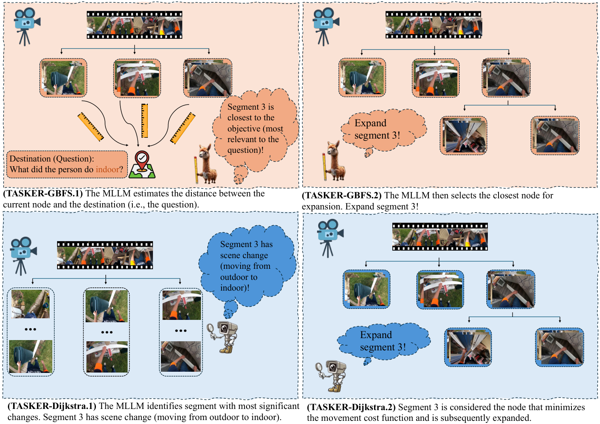
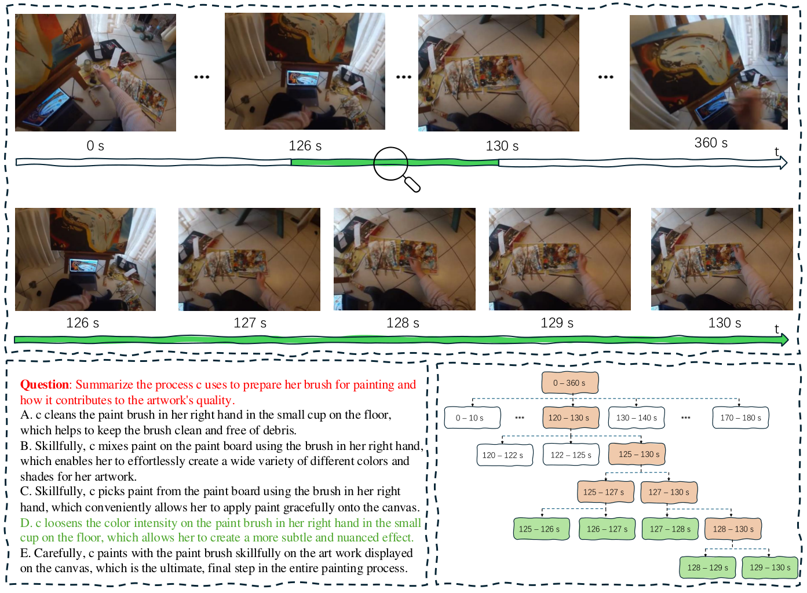
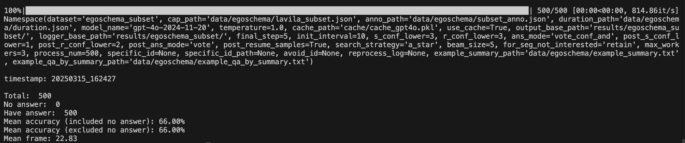

# 🌲 TASKER: Task-driven and Scene-aware Keyframe Search

[](https://lbesson.mit-license.org/)
[](https://arxiv.org/abs/2606.29445)
[](https://vg-gui-tasker.github.io/)

This directory contains **TASKER** (**Ta**sk-driven **a**nd **S**cene-aware **Ke**yframe sea**r**cher), the keyframe extraction algorithm from the ECCV 2026 paper [Bridging VideoQA and Video-Guided Agentic Tasks via Generalized Keyframe Extraction](https://arxiv.org/abs/2606.29445). For the project overview, see the [root README](../README.md).

> **Relation to AKeyS.** TASKER originates from and generalizes our earlier work **AKeyS** (*Agentic Keyframe Search for Video Question Answering*, [arXiv:2503.16032](https://arxiv.org/abs/2503.16032)). In this paper we rename AKeyS to TASKER and extend the algorithm **from VideoQA to video-guided agentic tasks**. The VideoQA code here is consistent with the original AKeyS codebase, so you can use it directly — there is no need to clone any separate AKeyS repository.

## Introduction

We present **TASKER**, a simple yet powerful algorithm for identifying keyframes in videos. It effectively distinguishes key information from redundant, irrelevant content by leveraging modern language agents to direct classical search algorithms. Concretely, TASKER first **segments the video and organizes it as a tree**; a language agent then estimates heuristics and movement costs while dynamically expanding nodes, and finally decides — based on termination conditions — whether enough keyframes have been collected. Variants include **TASKER-BFS / GBFS / Dijkstra / A\***.

A central finding of our paper is that this **same keyframe-search paradigm** benefits *two* levels of video understanding:

| Stage | Directory | Task | Model interface |
|-------|-----------|------|-----------------|
| 🔍 **VideoQA** | [`videoqa/`](videoqa/) | Low-level video question answering (EgoSchema, NExT-QA) | Caption/text-based LLM with response caching |
| 📱 **GUI (agentic)** | [`gui/`](gui/) | High-level video-guided GUI keyframe extraction feeding [VG-GUI-Bench](../VG-GUI-Bench/README.md) | Multi-image vision-language model (VLM) |

Both stages share the identical tree-search formulation; they differ only in the underlying model interface (text captions vs. multi-image VLM) and in the input data (generic web videos vs. GUI tutorial videos). This makes TASKER a **generalized** keyframe extractor that bridges VideoQA and video-guided agentic tasks.



## Installation 🛠️

TASKER is lightweight and can run on a personal computer without a GPU.

1. Clone the repository and enter this directory:

   ```bash
   git clone git@github.com:VG-GUI-TASKER/VG-GUI-TASKER.git
   cd VG-GUI-TASKER/TASKER
   ```

2. Create a virtual environment and install the dependencies (shared by both stages):

   ```bash
   python3 -m venv tasker_env
   source tasker_env/bin/activate
   pip install -r requirements.txt
   ```

3. Configure your model endpoint 🗝️.

   Both stages talk to an **OpenAI-compatible** endpoint (OpenAI, Azure OpenAI, or any local server such as vLLM / SGLang / LMDeploy). Set the following environment variables in `~/.bashrc` or `~/.zshrc`:

   ```bash
   export OPENAI_API_KEY="sk-..."
   export OPENAI_MODEL="gpt-4o-2024-11-20"      # model name to call
   # Optional — only needed for a self-hosted / non-default endpoint:
   export OPENAI_BASE_URL="http://127.0.0.1:8000/v1"
   ```

   Every entry point also accepts `--model_name`, `--api_key`, and `--base_url` on the command line, which override the environment variables.

---

## 🔍 Stage 1 — TASKER for VideoQA (`videoqa/`)

Reformulates keyframe extraction as a generalized graph search over caption segments, and lets an LLM decide which segments to expand until it is confident enough to answer.

Enter the directory first:

```bash
cd videoqa
```

**Demo.** A single-case walkthrough:

```bash
sh scripts/demo.sh
```



**EgoSchema experiments.** We obtained the dataset annotations and extracted captions from [LLoVi](https://drive.google.com/file/d/13M10CB5ePPVlycn754_ff3CwnpPtDfJA/view?usp=drive_link). Subset annotations and captions are already placed in `data/egoschema/`.

- If you would rather not pay for the OpenAI API, we provide our LLM conversation cache [here](https://drive.google.com/file/d/1c_wId28ozyGEQKd5x3Zl8ugmvDVlJSED/view?usp=sharing); specify its path in `arg_parser.py`.

- EgoSchema subset (500 videos):

  ```bash
  sh scripts/egoschema_subset.sh
  ```

- EgoSchema fullset — download annotations and captions from [LLoVi](https://drive.google.com/file/d/13M10CB5ePPVlycn754_ff3CwnpPtDfJA/view?usp=drive_link), set the data path in `arg_parser.py`, then run:

  ```bash
  sh scripts/egoschema_fullset.sh
  ```

The script runs automated evaluation and reports accuracy and mean frame number. For a step-by-step breakdown:

```bash
python3 analyze_results.py --filepath YOUR_RESULT_JSON_FILE_PATH
```

It outputs a histogram of solved problems and accuracy at each search step:



---

## 📱 Stage 2 — TASKER for GUI tutorials (`gui/`)

Applies the same tree-search algorithm to **GUI tutorial videos**, using a multi-image VLM to score segments and select the keyframes that best summarize *how to complete a task on the device*. The extracted frames become the `tasker` reference mode consumed by [VG-GUI-Bench](../VG-GUI-Bench/README.md).

Enter the directory and point it at your MONDAY dataset:

```bash
cd gui

# Configure paths via env vars (defaults assume ./MONDAY next to the benchmark)
export DATASET_ROOT=/path/to/MONDAY

# Extract keyframes for the whole test set
bash run.sh

# Or process one 10%-shard at a time (useful for parallel runs)
bash run.sh 1
```

Extracted images are written to `${DATASET_ROOT}/images/tasker/` and the per-video frame selection is recorded in `${DATASET_ROOT}/tasker_selected_frames.json`. Feed the resulting `tasker` mode into VG-GUI-Bench evaluation — see [`VG-GUI-Bench/README.md`](../VG-GUI-Bench/README.md).

Key search hyper-parameters (see `arg_parser.py`): `--search_strategy {bfs,gbfs,dijkstra,a_star}`, `--init_interval`, `--final_step`, `--min_steps`, `--beam_size`, `--conf_lower`.

---

## Acknowledgments

We thank the developers of [LLoVi](https://github.com/CeeZh/LLoVi), [VideoTree](https://github.com/Ziyang412/VideoTree), [VideoAgent](https://github.com/wxh1996/VideoAgent) and [HCQA](https://github.com/Hyu-Zhang/HCQA) for their public code release.

## Citation

If you find our repo useful, please kindly consider citing the ECCV 2026 paper:

```bibtex
@inproceedings{fan2026bridging,
  title     = {Bridging VideoQA and Video-Guided Agentic Tasks via Generalized Keyframe Extraction},
  author    = {Fan, Sunqi and Liu, Qingle and Yin, Runqi and Guo, Meng-Hao and Yang, Shuojin},
  booktitle = {European Conference on Computer Vision (ECCV)},
  year      = {2026}
}
```

This work builds upon our earlier AKeyS paper:

```bibtex
@misc{fan2025agentickeyframesearchvideo,
      title={Agentic Keyframe Search for Video Question Answering}, 
      author={Sunqi Fan and Meng-Hao Guo and Shuojin Yang},
      year={2025},
      eprint={2503.16032},
      archivePrefix={arXiv},
      primaryClass={cs.CV},
      url={https://arxiv.org/abs/2503.16032}, 
}
```
